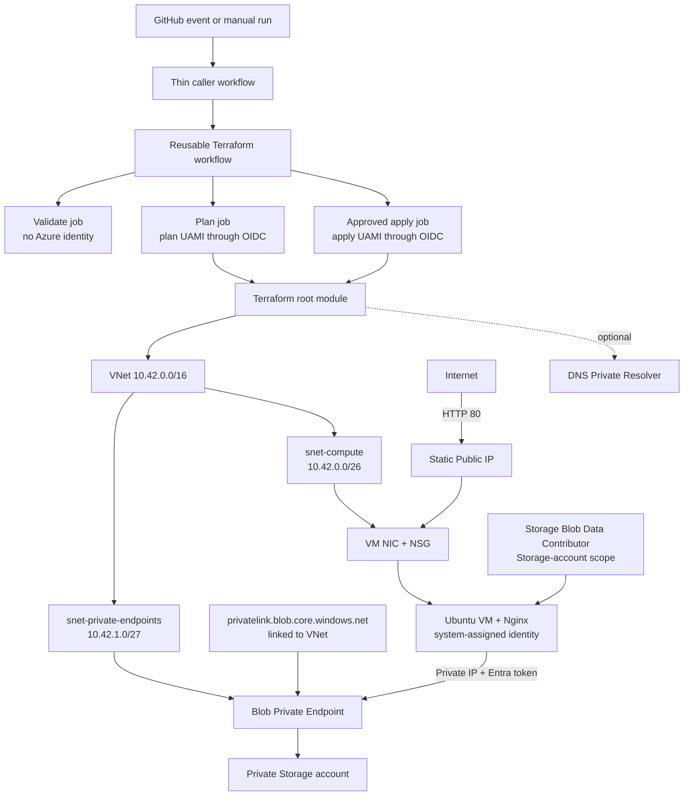

# Azure + GitHub Actions VM and private networking lab

This repository is a hands-on DevOps example organized like a small enterprise
platform. GitHub authenticates to Azure with OIDC, Terraform creates the
infrastructure, and an Ubuntu VM serves a visible Nginx success page.

The lab demonstrates:

- A thin GitHub Actions caller workflow and a multi-job reusable workflow
- Internal composite actions that call reviewed vendor actions
- GitHub OIDC federated to separate Azure plan and apply identities
- GitHub Environments, approval, least privilege, and concurrency
- A Terraform root module composing reusable child modules
- A VNet, compute subnet, NSG, Linux VM, static Public IP, and cloud-init
- A private Storage account, Blob Private Endpoint, Private DNS zone, VM
  system-assigned managed identity, and data-plane RBAC
- An optional Azure DNS Private Resolver module

No Azure client secret is created or stored.

## Architecture



The page at `http://PUBLIC_IP` proves public HTTP reaches Nginx. The separate
Storage path remains private: VNet DNS resolves the Storage hostname to the
Private Endpoint IP, and Storage then checks the VM identity's RBAC role.

## Cost warning

The VM, managed OS disk, Standard Public IP, Private Endpoint, Storage, and DNS
can incur charges. DNS Private Resolver endpoints are continuously billed and
are disabled by default. See [cost and cleanup](docs/COST-AND-CLEANUP.md) and
destroy the lab when you finish.

## Repository map

```text
.github/workflows/infrastructure.yml           thin caller
.github/workflows/reusable-azure-terraform.yml reusable orchestration
.github/actions/*/action.yml                   internal composite actions

infra/environments/dev/                        Terraform root module
infra/modules/network/                         VNet and subnets
infra/modules/linux-web-vm/                    VM, NIC, NSG, Public IP, cloud-init
infra/modules/storage/                         locked-down Storage account
infra/modules/private-dns/                     Private DNS zone and VNet link
infra/modules/private-endpoints/               Blob endpoint and DNS zone group
infra/modules/private-dns-resolver/            optional hybrid DNS

scripts/bootstrap-azure.ps1                    state, OIDC identities, RBAC
scripts/configure-github.ps1                   environments and repository vars
scripts/verify-azure.ps1                       resources, RBAC, and HTTP test
scripts/remove-bootstrap.ps1                   final cleanup
```

## Prerequisites

1. An Azure subscription with Compute quota for the selected VM size and region.
2. A GitHub repository containing this code.
3. Azure CLI, GitHub CLI, and PowerShell.
4. Azure permission to create resource groups and role assignments. `Owner`, or
   equivalent resource and RBAC permissions, is simplest for this lab.
5. A GitHub plan supporting any Environment protection rules you want to test.

Terraform does not need to be installed locally; the workflow installs its
locked version on the GitHub runner.

## Run the lab

### 1. Bootstrap Azure and configure GitHub

For a new lab:

```powershell
az login
az account set --subscription "YOUR-SUBSCRIPTION-ID"

./scripts/bootstrap-azure.ps1 `
  -GitHubOwner "YOUR-GITHUB-OWNER" `
  -GitHubRepository "azure-private-app-lab" `
  -Location "eastus"

gh auth login
./scripts/configure-github.ps1
```

Bootstrap creates the Terraform state account, lab resource group, two
user-assigned deployment identities, their GitHub federated credentials, and
their RBAC assignments. It does not create the VM.

If bootstrap was already run for the earlier App Service version, do not run it
again. Register the VM resource provider once:

```powershell
az provider register --namespace Microsoft.Compute --wait
```

Keep the existing GitHub variables, OIDC identities, state account, state key,
and `development`/`terraform-plan` Environments.

### 2. Confirm the VM size

The default is `Standard_F1als_v7`. It must be offered in the lab resource
group's region and your subscription must have Compute vCPU quota for it.
Check both availability and Compute quota:

```powershell
az vm list-skus `
  --location eastus `
  --size Standard_F1als_v7 `
  --all `
  --output table

az vm list-usage --location eastus --output table
```

The App Service quota that blocked the earlier design is a different quota.
For this VM, confirm at least one regional vCPU and one Falsv7-family vCPU are
available. This module explicitly uses an NVMe disk controller, so do not swap
in a SCSI-only VM size without also changing the controller setting.

### 3. Commit and push

```powershell
git add .
git commit -m "Switch Azure lab from App Service to a web VM"
git push
```

A push runs validation and plan only. It creates no new Azure workload
resources.

### 4. Apply

In GitHub, open **Actions → Azure infrastructure caller → Run workflow**:

1. Select `operation=apply` on branch `main`.
2. Read the saved Terraform plan.
3. Approve the `development` Environment when prompted.
4. Wait for apply to finish, then allow another two to five minutes for
   cloud-init to install and start Nginx.

The existing state key remains `azure-private-app-dev.tfstate`. Do not change
it during this migration; it tracks resources from the earlier partial apply.

### 5. Open the web page

Run:

```powershell
./scripts/verify-azure.ps1
```

The script prints a line such as:

```text
Browser URL: http://20.1.2.3
```

Open that URL in a browser. Use `http`, not `https`; this learning VM has no TLS
certificate. The page should say **Deployment successful**.

You can also find it in the Azure portal:

1. Open **Resource groups → rg-ghazdemo-dev**.
2. Select the resource whose type is **Virtual machine**.
3. On **Overview**, confirm **Status: Running** and copy **Public IP address**.
4. Open `http://PUBLIC_IP`.

### 6. Optional DNS Private Resolver

The linked Private DNS zone already works within this VNet. Resolver is needed
only for hybrid or centralized DNS. To study it briefly:

```powershell
gh variable set ENABLE_PRIVATE_DNS_RESOLVER `
  --body true `
  --repo YOUR-GITHUB-OWNER/azure-private-app-lab
```

Apply again, then set the variable back to `false` and apply when finished.

### 7. Destroy

1. Run **Destroy Azure learning lab** and enter `DESTROY`.
2. Approve the `development` Environment.
3. After Terraform destroy succeeds, remove bootstrap resources only if you are
   completely finished:

```powershell
./scripts/remove-bootstrap.ps1 -Confirmation DESTROY-BOOTSTRAP
```

## Continue learning

- [Why every step exists](docs/WALKTHROUGH.md)
- [Enterprise repository split](docs/ENTERPRISE-SPLIT.md)
- [Cost and cleanup](docs/COST-AND-CLEANUP.md)

Useful references:

- [Azure Linux VMs](https://learn.microsoft.com/en-us/azure/virtual-machines/linux/overview)
- [Network security groups](https://learn.microsoft.com/en-us/azure/virtual-network/network-security-groups-overview)
- [Managed identities](https://learn.microsoft.com/en-us/entra/identity/managed-identities-azure-resources/overview)
- [Azure Private Endpoint DNS](https://learn.microsoft.com/en-us/azure/private-link/private-endpoint-dns)
- [Azure DNS Private Resolver](https://learn.microsoft.com/en-us/azure/dns/dns-private-resolver-overview)
- [GitHub OIDC with Azure](https://learn.microsoft.com/en-us/azure/developer/github/connect-from-azure-openid-connect)
- [Terraform AzureRM backend](https://developer.hashicorp.com/terraform/language/backend/azurerm)
