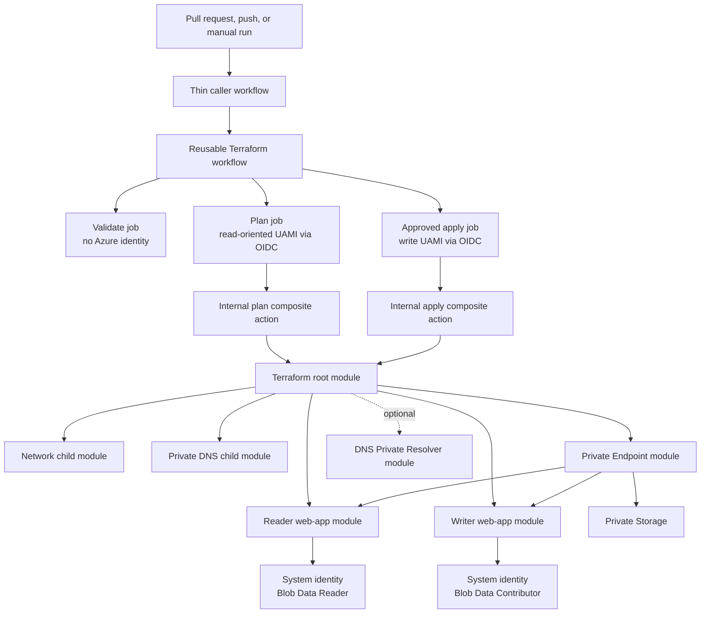

# Azure + GitHub Actions private application lab

This repository is a hands-on DevOps example built around the enterprise architecture. It is deliberately structured like a small enterprise platform rather than one large workflow or one large Terraform file.

It demonstrates:

- A thin GitHub Actions **caller workflow**
- A multi-job **reusable workflow**
- Internally written **composite actions** that call vendor actions
- GitHub **OIDC** federated to Azure user-assigned managed identities
- Separate read-oriented plan and write-capable apply identities
- GitHub **Environments**, approval, least privilege, and concurrency
- A Terraform **root module** composing reusable **child modules**
- Azure VNet, delegated subnets, Linux App Service, Storage, Private Endpoints,
  Private DNS zones, system-assigned identities, and data-plane RBAC
- An optional Azure DNS Private Resolver module

No Azure client secret is created or stored.

## Architecture



## Cost warning

This lab creates billable resources. The baseline includes a continuously
billed B1 App Service Plan and three Private Endpoints. Azure DNS Private
Resolver endpoints are also continuously billed, so the resolver is
implemented but disabled by default. Review [cost and cleanup](docs/COST-AND-CLEANUP.md)
before applying and destroy the lab when you finish.

## Repository map

```text
.github/workflows/infrastructure.yml          thin caller
.github/workflows/reusable-azure-terraform.yml reusable orchestration
.github/actions/*/action.yml                  internal composite actions

infra/environments/dev/                       Terraform root module
infra/modules/network/                        VNet and delegated subnets
infra/modules/private-dns/                    Private DNS zones and VNet links
infra/modules/storage/                        locked-down Storage account
infra/modules/app-service-plan/               shared Linux compute plan
infra/modules/web-app/                        reusable private web app
infra/modules/private-endpoints/              generic endpoint + DNS groups
infra/modules/private-dns-resolver/           optional hybrid DNS

scripts/bootstrap-azure.ps1                   state, OIDC identities, RBAC
scripts/configure-github.ps1                  environments and repository vars
scripts/verify-azure.ps1                      control-plane verification
scripts/remove-bootstrap.ps1                  final cleanup
```

## Prerequisites

You need:

1. An Azure subscription where you can create resource groups and role
   assignments. `Owner`, or equivalent resource plus RBAC permissions, is the
   simplest lab setup.
2. A GitHub repository for this code.
3. [Azure CLI](https://learn.microsoft.com/en-us/cli/azure/install-azure-cli-windows)
   and [GitHub CLI](https://cli.github.com/) on your workstation.
4. PowerShell 7 or Windows PowerShell 5.1.
5. A GitHub plan that supports the Environment protection rules you want to
   test. The workflow still works without required reviewers, but approval is
   an important part of the exercise.

Terraform does not need to be installed locally for the GitHub workflow; the
vendor setup action installs the exact version on the runner.

## Run the lab

### 1. Create the GitHub repository

Create an empty repository, for example `azure-private-app-lab`. Do not change
the repository owner/name after bootstrapping because they are part of the OIDC
trust subject.

### 2. Bootstrap Azure

Sign in and select the intended tenant/subscription:

```powershell
az login
az account set --subscription "YOUR-SUBSCRIPTION-ID"
```

Then run:

```powershell
./scripts/bootstrap-azure.ps1 `
  -GitHubOwner "YOUR-GITHUB-OWNER" `
  -GitHubRepository "azure-private-app-lab" `
  -Location "eastus"
```

The script creates:

- A bootstrap resource group
- A public-network-reachable but Entra-only Storage account for Terraform state
- A lab resource group
- A plan user-assigned managed identity
- An apply user-assigned managed identity
- One environment-scoped federated credential on each identity
- Narrow Azure and state-container role assignments

It writes non-secret identifiers to the ignored `bootstrap-output.json` file.
See [the complete explanation](docs/WALKTHROUGH.md#1-bootstrap-the-trust-and-state-layer).

### 3. Configure GitHub

```powershell
gh auth login
./scripts/configure-github.ps1
```

The script creates the `terraform-plan` and `development` GitHub Environments
and sets repository variables. It creates no GitHub or Azure secret.

In GitHub, open **Settings → Environments → development** and:

- Add a required reviewer
- Restrict deployments to `main`
- Disable protection-rule bypass if your plan offers it

The federated identity credential matches the Environment name exactly, so do
not rename it without also updating Azure.

### 4. Push this repository

If this directory is not already connected to GitHub:

```powershell
git init -b main
git add .
git commit -m "Add Azure GitHub Actions learning lab"
git remote add origin https://github.com/YOUR-GITHUB-OWNER/azure-private-app-lab.git
git push -u origin main
```

A push to `main` produces a plan only. It does not create Azure application
resources automatically.

### 5. Plan and apply

In the GitHub **Actions** tab, open **Azure infrastructure caller**:

1. Run the workflow with `operation=plan`.
2. Read the validation and Terraform plan logs.
3. Run it again with `operation=apply`.
4. Review the saved plan job.
5. Approve the `development` Environment.

The apply job downloads and executes the exact planned workspace; it does not
generate a new plan after approval.

### 6. Verify

After Azure RBAC has propagated:

```powershell
./scripts/verify-azure.ps1
```

The script checks the Azure control plane: resources, endpoint connection
state, DNS zones, and managed-identity principal IDs.

Both web apps have public access disabled. A normal browser or public
GitHub-hosted runner should not reach them. To test private data-plane access,
use a VNet-connected runner/test host and the normal
`https://APP.azurewebsites.net` hostname. Do not browse directly to the private
IP because TLS and App Service host routing require the hostname.

### 7. Optional DNS Private Resolver

Private DNS zones linked to this single VNet already work without a resolver.
The resolver becomes useful when on-premises, another cloud, or a centralized
hub must resolve Azure-private zones, or Azure must conditionally forward a
corporate suffix.

To create the inbound endpoint, outbound endpoint, and forwarding ruleset:

```powershell
gh variable set ENABLE_PRIVATE_DNS_RESOLVER `
  --body true `
  --repo YOUR-GITHUB-OWNER/azure-private-app-lab
```

Run `operation=apply` again. Set the variable back to `false` and apply when you
finish this part; otherwise the resolver endpoints keep accruing charges.

### 8. Destroy

1. Run **Destroy Azure learning lab**.
2. Enter `DESTROY`.
3. Approve the `development` Environment.
4. After Terraform finishes, remove the bootstrap/state resources:

```powershell
./scripts/remove-bootstrap.ps1 -Confirmation DESTROY-BOOTSTRAP
```

The final script deletes the two exact resource groups recorded during
bootstrap. See [the cleanup checklist](docs/COST-AND-CLEANUP.md#cleanup-order).

## Continue learning

- [Why every step exists](docs/WALKTHROUGH.md)
- [How to split this into enterprise repositories](docs/ENTERPRISE-SPLIT.md)
- [Cost and cleanup](docs/COST-AND-CLEANUP.md)

Useful primary references:

- [GitHub reusable workflows](https://docs.github.com/en/actions/how-tos/reuse-automations/reuse-workflows)
- [GitHub OIDC with reusable workflows](https://docs.github.com/en/actions/how-tos/secure-your-work/security-harden-deployments/oidc-with-reusable-workflows)
- [Azure Login with OIDC](https://learn.microsoft.com/en-us/azure/developer/github/connect-from-azure-openid-connect)
- [Terraform AzureRM backend](https://developer.hashicorp.com/terraform/language/backend/azurerm)
- [App Service Private Endpoint](https://learn.microsoft.com/en-us/azure/app-service/overview-private-endpoint)
- [Azure Private Endpoint DNS zones](https://learn.microsoft.com/en-us/azure/private-link/private-endpoint-dns)
- [Azure DNS Private Resolver](https://learn.microsoft.com/en-us/azure/dns/dns-private-resolver-overview)

